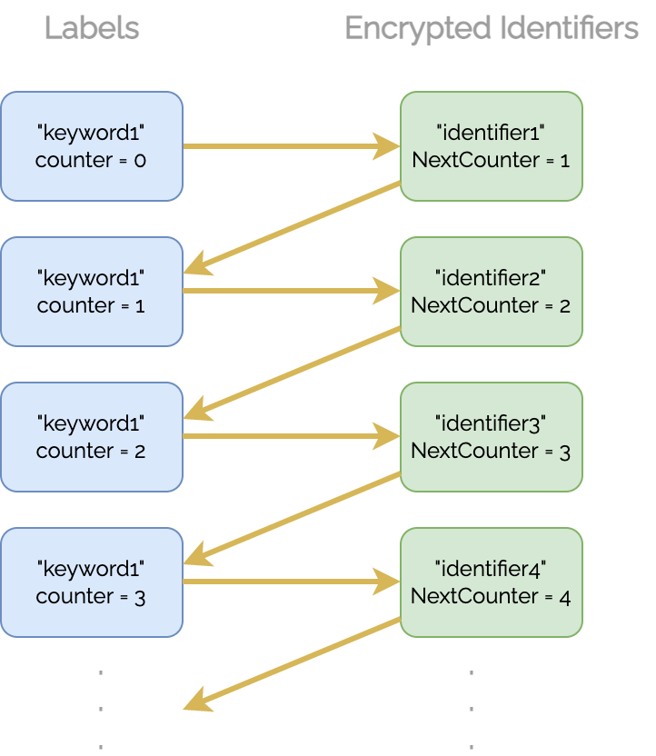

# CYBERCRYPT D1 library explainer

This document defines the main concepts and use cases for the D1 library.

# Concepts

## *Provider concepts*

**Providers** are interfaces that the library relies on for delivering functionality that is necessary, but orthogonal, to the implemented cryptographic mechanisms. The users of the library can plug in various implementations of the same **Provider** behavior, depending on their use-case.


### Key Provider

The **Key Provider** is the source of cryptographic key material for the library. Implementations of its [interface](https://pkg.go.dev/github.com/cybercryptio/d1-lib/key#Provider) must be able to provide four 256-bit keys: Key Encryption Key (KEK), Access Encryption Key (AEK), Token Encryption Key (TEK), Index Encryption Key (IEK).

### IO Provider

The **IO Provider** acts as a source and destination for the [encrypted data](#data-concepts) produced/consumed by the library. Implementations of its [interface](https://pkg.go.dev/github.com/cybercryptio/d1-lib/io#Provider) could use various types of storage, for example: blob storage, relational databases, queues, in-memory storage, etc.

### Identity Provider

The **Identity Provider** is the source of identifying information about the caller of the library. It allows the library to validate [**Identity Tokens**](#identity-token) and fetch their corresponding [**Identity**](#identity) objects. Implementations of its [interface](https://pkg.go.dev/github.com/cybercryptio/d1-lib/id#Provider) could use various Identity and Access Management (IAM) solutions such as SAML or OpenID. For easily getting up and running, the library implements a [**Standalone Identity Provider**](#standalone-identity-provider).

### Identity

An **Identity** is an object that contains data about the caller of the library. This data includes:
- a string that uniquely identifies each instance;
- the [**Scopes**](#scope) of the caller;
- the **Groups** that the caller belongs to.

The **Identity Provider** implementation must decide the format of the identifying strings for **Identities** and **Groups**, as well as ensure their uniqueness across instances.

### Scope

**Scopes** are used to control access to the [**Encrypted Objects**](#object). **Identities** have associated **Scopes**, and they can only perform operations on [**Data**](#data-concepts) when they have the required scopes. [See our documentation for examples of how to enforce access control using the D1 library.](https://pkg.go.dev/github.com/cybercryptio/d1-lib#example-package-AccessControl)

### Identity Token

**Identity Tokens** are strings provided by the library callers so that they can be authenticated by the **Identity Provider**. When authenticating a call, the **Identity Provider** validates the token and returns an **Identity** object with the caller data. These tokens should preferably be opaque to anyone but the **Identity Provider**.

### Standalone Identity Provider

The [**Standalone Identity Provider**](https://pkg.go.dev/github.com/cybercryptio/d1-lib/id#Standalone) is an **Identity Provider** implementation designed to easily get up and running for the library users who do not have an existing IAM system in place. It provides the following functionalities:
- Creating and managing **Users**, **Groups** and **Identity Tokens**;
- Translating between **Identity Tokens** and **Identities**;
- Storing the user data with the configured **IO Provider**;
- Encrypting **Users**, **Groups** and **Identity Tokens** using the configured encryption keys: User Encryption Key (UEK), Group Encryption Key (GEK), Token Encryption Key (TEK).

#### User

A **User** is a data structure used by the **Standalone Identity Provider** to store data about the callers of the library. **Users** are uniquely identified using a Universally Unique Identifier (UUID) as defined in the [RFC-4122](https://datatracker.ietf.org/doc/html/rfc4122) standard, and they authenticate to the **Standalone Identity Provider** with their UUID string and a password provided upon user creation. A **User** structure contains the salt and hash of the **User's** password, its **Scopes** and a set of **Groups** that the **User** is a member of.

#### Group

A **Group** is a data structure used by the **Standalone Identity Provider** to manage sets of **Users**. **Groups** have their own associated **Scopes** and can be used to manage access to [**Encrypted Objects**](#object) for multiple users at a time.

Only **Users** who are part of a **Group** are allowed to modify its members or **Scopes**.

## *Data concepts*

### Object

An **Object** contains binary data owned by a **User** which can be encrypted resulting in an **Encrypted Object** and an **Access List**. 

Besides the binary data itself, an **Object** can optionally contain some additional associated data, which will not be encrypted in the **Encrypted Object**, but it’s integrity is checked in the decryption process. This associated data can be used, for example, for indexing encrypted objects.

### Access List

Each **Encrypted Object** has a corresponding **Access List**, which is used to control who is able to decrypt the object. **Access Lists** are encrypted, and they contain in their ciphertext a set of IDs of the **Groups** which are allowed to decrypt the corresponding **Encrypted Object**.

Only **Users** who are part of the **Access List** are allowed to modify it. By default, an **Access List** has only the ID of the default **Group** of the **User** who created it.

### Token

A **Token** represents some arbitrary encrypted data with an attached expiration time. Data inside of a **Token** is not access controlled, i.e. it can be decrypted by any caller of the library as long as the expiration time hasn’t passed.

### Search Index

A **Search Index** is an object used to map keywords to **Encrypted Objects**, allowing the ability to search over encrypted data. The **Search Index** cryptographically hides the contents and the number of keywords and **Encrypted Objects**, as well as the mapping between them.

# Use cases

The D1 library allows **Users** to encrypt **Objects** and to restrict the ability to decrypt only for specific user **Groups** through the **Access Lists**. Additionally, the library offers support for creating encrypted security tokens and for searching over encrypted data.

## Application layer encryption

The majority of software applications use encryption for securing data in-transit and at-rest. This means that the data is protected only while being transferred over the network and while being stored, and any compromised software or machine in the data path can leak sensitive data. Application layer encryption reduces the attack surface by encrypting data end-to-end, inside the applications that create and consume it.

The D1 library provides cryptographic functions for protecting data and enforcing access control, which can be used to implement application layer encryption.


## Storing data in untrusted locations

Storing sensitive data in the cloud can be risky as you have to trust that the cloud provider has good security protections to avoid unauthorized access to the data. Moreover, you have to make sure that you configure the security mechanisms offered by the cloud provider properly which can in and of itself be challenging in multi-cloud setups.

The D1 library can be used to encrypt data at the application layer, before being sent to the storage, allowing its users to not rely only on the cloud providers to protect their sensitive data.


## Granular access control

The D1 library can be used to implement various access control schemes for protecting data and ensuring that only certain applications/users can decrypt it. This can for example be used to ensure that applications that produce data can encrypt it, but cannot read it, minimizing the risk of a data leak if that application is compromised. 


## Searchable encrypted data

The D1 library implements a secure index which can be used to create Searchable Symmetric Encryption which allows users to search for keywords in encrypted data without decrypting it. 


### Secure index

A secure index is an encrypted map on which 3 operations can be queried, `Add`, `Search`, and `Delete`.

> Usually, the elements in a hash map are called keys and values. In this context the keys are referred to as *labels* in order to not mix them up with encryption keys.

* `Add` takes as input a keyword and an identifier (e.g. a document ID), computes an encrypted label -> value pair, and stores it in a secure index. The label -> value pair maps the given keyword to the given identifier.
* `Search` takes as input a keyword, computes the corresponding encrypted labels, finds the encrypted values in the secure index that the labels map to, decrypts them, and returns the plaintext identifiers to the user.
* `Delete` takes as input a keyword and an identifier, computes the encrypted label -> value pair, and deletes that pair from the secure index.

The security properties that the implementation brings are:
* The total number of keyword/identifier pairs is hidden from the caller (but not from the IO Provider).
* The total number of identifiers and keywords is hidden from both the caller and the IO Provider.
* The D1 Library does not leak unencrypted keywords or identifiers to any other parties than the caller.
* The IO Provider cannot learn anything from the queries about which identifiers contain which keywords as everything (keywords and identifiers) is encrypted in the IO Provider.

### Usage
Consider a scenario with 3 different documents identified as `id1`, `id2`, `id3`, respectively. The documents contain, among other words, the following keywords, and the keyword/identifier pairs can be added to the secure index.

* `id1` contains the keyword `keyword1`. 
* `id1` and `id2` both contain the keyword `keyword2`.
* `id2` contains the keyword `keyword3`.
* `id1`, `id2`, and `id3` all contain the keyword `keyword4`.

Given a keyword for a `Search` query, all the identifiers that contain the given keyword can then be identified, even when the documents are encrypted. Given e.g. `keyword4` for a `Search` query, the output will be `["id1", "id2", "id3"]`. If keyword `keyword4` and identifier `id1` are then given to a `Delete` query, then the output from the `Search` query on input `keyword4` will now be `["id2", "id3"]`.

### Implementation

In this section, some more technical details about the implementation are given.

Given a keyword and an identifer for an `Add` query, a label is computed based on a secret key, the keyword, and a *counter* (explained below), and an Identifier struct representing the identifier is created. The label is then mapped to the Identifier as shown below, and the "label -> Identifier" correlation is stored in the secure index. The Identifier is encrypted before it is stored in order to avoid having plaintext keywords or identifiers outside of the D1 Library. Note that the keyword is used to encrypt the Identifier which means that the encrypted Identifier can only be decrypted if the keyword is known.

In secure index:
```go
label(secret key, keyword, counter) -> encrypted Identifier(keyword, identifier)
```

An Identifier struct (before encryption) contains the identifier itself as well as a `NextCounter` as shown below. `NextCounter` is used to compute the next label based on the same keyword. If the keyword has only been mapped to a single identifier, then its encrypted Identifier's `NextCounter` is 0. Given a keyword for a `Search` query, all the identifiers that it maps to, i.e. all the identifiers that contain the given keyword, are then easily found by going through the chain of `NextCounter`'s and computing the corresponding label for each counter. The chain is illustrated below. It is ensured that the counter used to compute the first label in the chain is always known.

```go
Identifier = {
    Identifier:   "id1",
    NextCounter:  1,
}
```



Given a keyword and an identifer for a `Delete` query, the correct label/encrypted Identifier pair is found and deleted. The chain remains intact as the previous `NextCounter` is updated to the deleted encrypted Identifier's `NextCounter`.